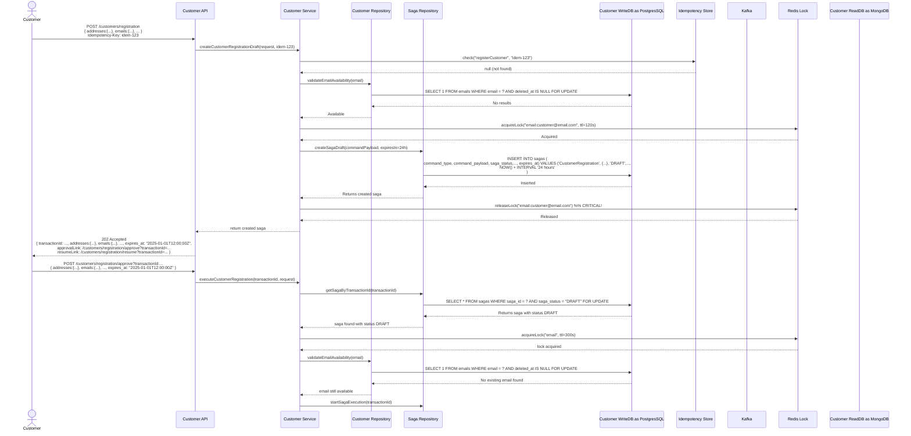

# Project

Kotlin + Spring Boot service using Gradle. This repository contains domain models, sagas and tests (including
property-based tests using Kotest).

## Tech stack

- Kotlin
- Spring Boot
- Gradle
- Kotest (unit + property tests)
- SQL (DB access)

## Prerequisites

- JDK 17+
- Gradle (wrapper included)
- macOS (development environment)

## Build

Run the Gradle wrapper:
./gradlew clean build

## Run

Start the Spring Boot app:
./gradlew bootRun

Run unit and property tests:
./gradlew test

## Schemas

### Customer Registration Sequence Diagram

